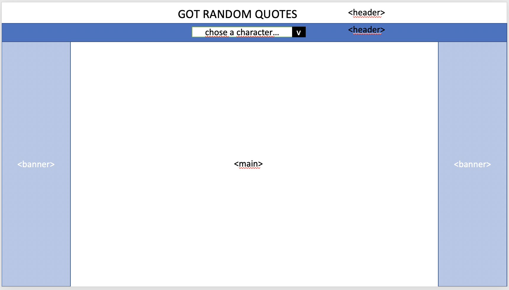
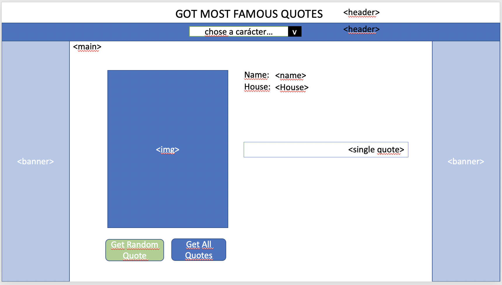
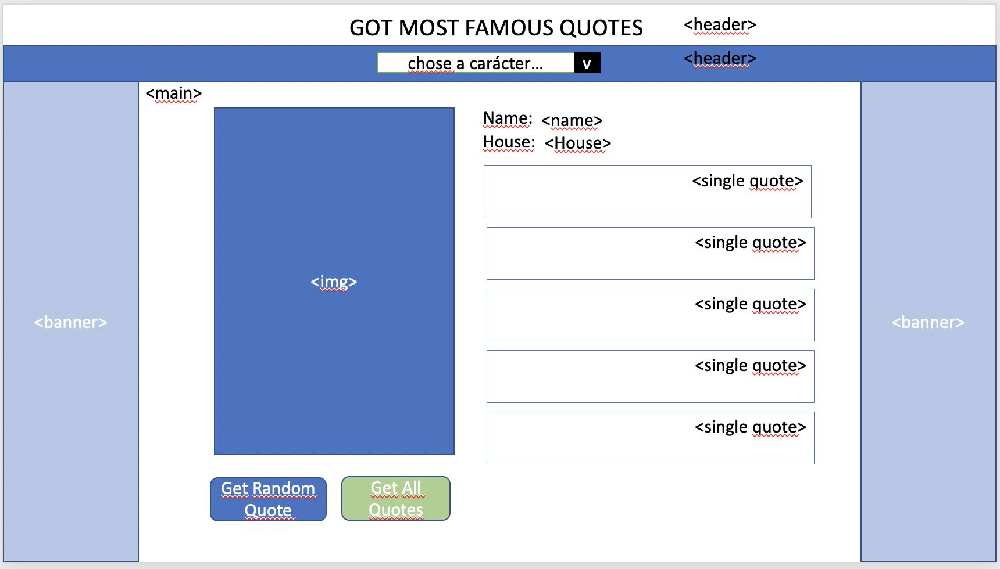

# Project 3 - Got Random Quotes

Team:

- Sachin Ramteke
- Edgar Martinez

<!--  -->

## Project Overview:-

## Project Description

"Got Random Quotes" App is designed for searching the random quotes by popular characters.
This web responsive app displays the characters name and also allows you to browse their wikipedia pages.

### Learning Goal: Develop a REACT application with the following features

- Use a third party API; Usage of axios
- Usage of React Components
- State management
- GIT code integration - code check-in, check-out, branch merges

- Heroku production deployment
- Implementation of REST-ful routes

## Minimum Viable Product (MVP):-

- MVP goal: The React application (i.e. Got Random Quotes) has been designed and developed to provide a basic search functionality for random quotes, respective author, their wiki pages, and their images:

- A working REACT application, using Node.js, Express, React Dom, React Dom Router

* Connect to third party Quotes API
* Render Quotes API data on webpage
* Allow users to interact with the page and perform Quotes searches

## Project Links

GitHub Repository:
- Git Master Branch :- https://github.com/emdlr/GOTQuotes/tree/master

- Git Sub-Branches:

  - Edgar :- https://github.com/emdlr/GOTQuotes/tree/edgar
  - Sachin :- https://github.com/emdlr/GOTQuotes/tree/sachin

deployment :-

3rd Party API Link: https://gameofthronesquotes.xyz/

## Wireframes

App homepage Wireframe: (included under documents folder)

## Technologies

- Visual Studio Code – Main Development Tool
- REACT Framework
- CSS
- JavaScript
- Node.JS
- JSON
- Express
- Browser compliant: Chrome, IE, Firefox

## File Structure:

gotquotes-app (React App)

- REDME.md
- node_modules
- package.json
- package-lock.json
- public
  - Images
- src
  - Components
  - Images.json

## Additional Libraries

- Dependencies on following packages:
  - "@testing-library/jest-dom": "^4.2.4",
  - "@testing-library/react": "^9.3.2",
  - "@testing-library/user-event": "^7.1.2",
  - "axios": "^0.20.0",
  - "react": "^16.13.1",
  - "react-dom": "^16.13.1",
  - "react-router": "^5.2.0",
  - "react-router-dom": "^5.2.0",
  - "react-scripts": "3.4.3"

## Framework used

- REACT Framework

REACT Components:

- Header.js - for rendering a header and navigation bar
- MainRandomQuote.js - for displaying random quotes using api
- Character.js - for displying character details - their names, images, and link to wiki pages

App.js: contains code for API call, routes to the components, and rendering elements of App.
images.json: this data file contains images of characters that were downloaded from the internet

## App Components

- App:- This will make the initial data pull and include functionality, React Router
- Header:- This will render the header including the navigation bar
- Footer:- This will render the footer

## MVP User Stories:

1.  UserStory 01: App Landing page

    - As a user, I would like to see the Quotes App homepage

2.  UserStory 02: Display random quote on load of hmepage

    - As a user, when the app loads, I would like to see a random quote on the screen every 6 seconds.

3.  UserStory 03: Search Quote by character names

    - As a user, I would like the ability to search quotes based on character names. Specifically, after secting a character name from the dropdown and clicking on a "Search" button, display character-name, character-image.

4.  UserStory 04: Link to WiKi pages after clicking character images

    - When user clicks character-image, display the wikipedia page for the chosen character.

5.  UserStory 05: Web-Responsive

    - When user minimizes the browser-window, app should scale accroding the size of browser-window

## Issues and Resolutions

ERROR:
Faced issues while merging two different branches.

WDXSR39865VCG:gotquotes-app sr39865\$ git branch

edgar
master
sachin
WDXSR39865VCG:gotquotes-app sr39865\$ git checkout sachin
gotquotes-app/src/App.css: needs merge
gotquotes-app/src/App.js: needs merge
gotquotes-app/src/components/Header.js: needs merge
gotquotes-app/src/components/MainRandomQuote.js: needs merge
error: you need to resolve your current index first

RESOLUTION: needed git add & git commit after checkout

## Next Steps: "PostMVP"

- Convert Components to Hooks
- Use a CSS framework like Bootstrap
- Use additional APIs
